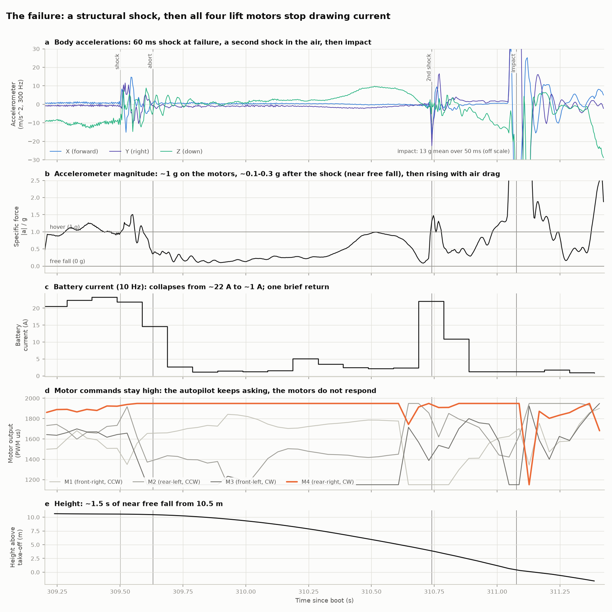
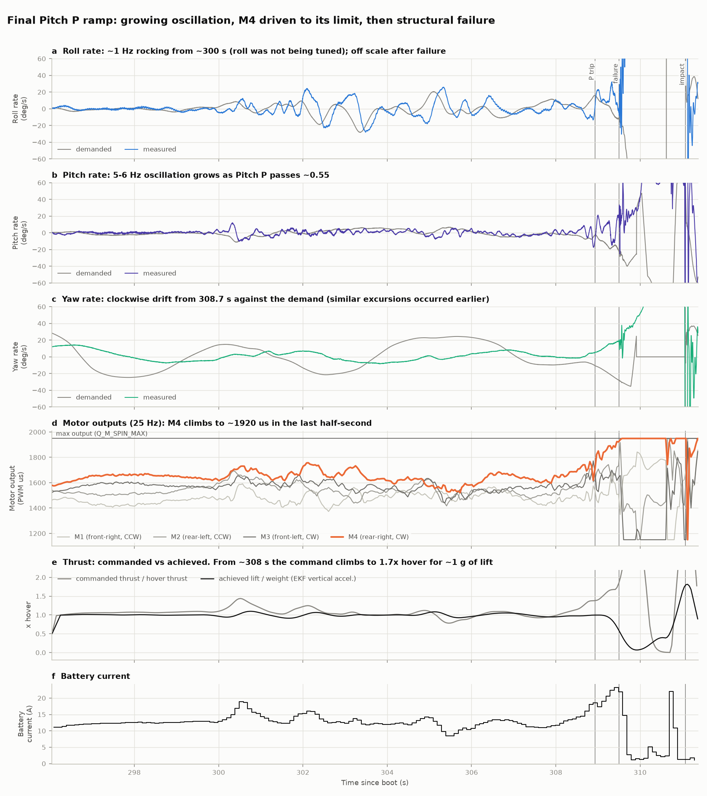
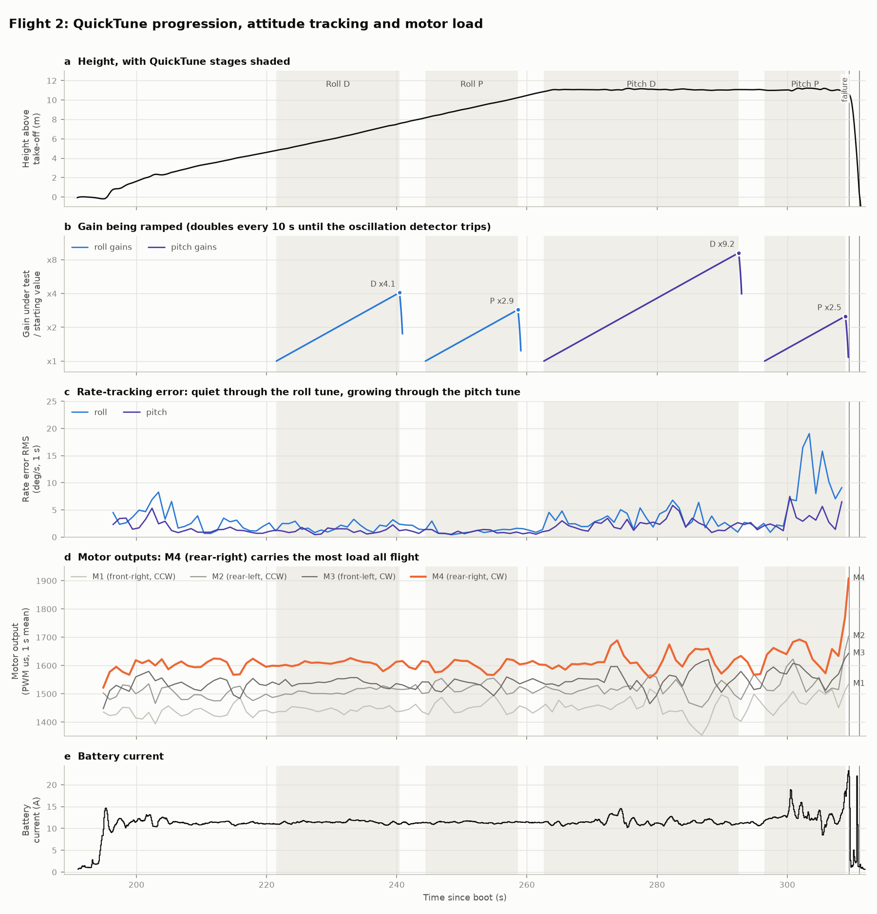
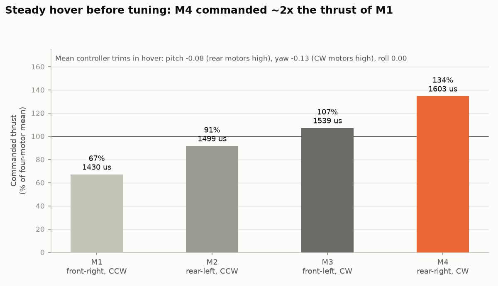

# TerraHawk v1: QuickTune hover crash, 2026-09-27

Log `00000008.BIN`. ArduPlane 4.7.1 on a TBS Lucid H7 Wing, QuadPlane QUAD/X,
lift motors on DShot300. Crash at about 11:19:47 UTC. All times in this report are
**seconds since boot**, as they appear in the log. Every number and figure here is
reproduced by [`analyze_crash.py`](analyze_crash.py) (see
[Reproducing](#reproducing)).

## Verdict

> **Root cause, in short.** A QuickTune-driven oscillation overloaded the mount of
> the most heavily loaded lift motor (M4, rear-right) until it failed in flight.
> The failure also cut drive to all four lift motors, so the aircraft fell about
> 10.5 m. The tune got that far because the vehicle wasn't set up the way
> QuickTune assumes: no harmonic notch, a 2:1 built-in thrust imbalance, tuning at
> about 11 m, and a 10° abort threshold that the oscillation never reached.

**What brought it down.** At **309.50 s**, about 10.5 m up, there was a structural
failure, and within about 50 ms it cut drive to **all four lift motors**. The FC
stayed powered and kept commanding high outputs, but battery current fell from
about 22 A to about 1 A. The aircraft dropped almost freely for 1.6 s and hit at
11.9 m/s. The accelerometers clipped; averaged over 50 ms the impact was 12.8 g.

**What led to it.** The QuickTune **pitch** stages.

- Pitch D was ramped to **9.2×** its starting value before the oscillation
  detector tripped, and was left at **3.7×**.
- Pitch P was then ramped, and Pitch I with it (`QWIK_RP_PI_RATIO` = 1).
- From about 300 s the aircraft rocked in roll, and in the last 1.5 s a 5–6 Hz
  pitch oscillation built up.
- The controller drove **M4 (rear-right)**, the motor already carrying the most
  load, to about 97% output with large cyclic swings. The autopilot needed
  **1.6× hover thrust** just to hold height.
- The detector tripped at 308.93 s and cut Pitch P, but by then the airframe was
  at its limit. In the last half-second the autopilot commanded 1.6× hover thrust
  for no extra lift. In the last 0.25–0.3 s vibration left its normal range on
  both IMUs. Then the structure broke. See
  [How early were there signs?](#how-early-were-there-signs)

**Why it got that far.**

1. **A large built-in thrust imbalance.** In steady hover, before any tuning, M4
   was commanded about **2× the thrust of M1**. The CG is aft of the thrust centre
   and there is a big yaw trim, and both land on M4. M4 had the least headroom and
   carried the largest steady and cyclic loads.
2. **The vehicle wasn't prepared the way QuickTune assumes.**
   - No harmonic notch. QuickTune *"relies on you already having reduced gyro noise
     using the harmonic notch filter. It will fail if your noise is too high."*
   - No bidirectional DShot and no battery-voltage thrust compensation.
   - The tune ran at about 11 m instead of the recommended about 3 m.
3. **A mount that couldn't take the loads, on a quad.** A quad has no motor
   redundancy, so losing any one motor or mount is a crash.

**Why it became a free fall rather than a tumble on three motors.** Propulsion was
lost on all four motors, not just M4. That points at the shared power or signal
path to the ESCs, or at ESC resets. The log alone cannot say which (see
[Inspect](#what-the-log-cannot-tell-you--inspect-these)).

## Timeline (flight 2)

| Time (s) | Event |
|---:|---|
| 190.9 | Armed in QLOITER. Take-off at about 193 s |
| 214.1 | QuickTune started. The pilot reverted it at 219.7 and restarted it at 221.5 |
| 221.5 – 240.4 | Roll D ramp. Tripped at ×4.1, left at 0.0059 (×1.6) |
| 244.4 – 258.6 | Roll P (+I) ramp. Tripped at ×2.9 on a clean 22 Hz roll oscillation, left at 0.287 (×1.15) |
| 262.6 – 292.5 | Pitch D ramp. Tripped at **×9.2**, left at **0.0133 (×3.7)** |
| 296.5 – 308.9 | Pitch P (+I) ramp from 0.25 to 0.63 |
| ≈ 300 | Roll rocking starts (about 1 Hz, ±5°). Roll rate-tracking error 5–8× higher; current bursts to 19 A |
| 304.5 – 309 | Pilot eases throttle from 1509 to 1420 µs. That requests at most 0.18 m/s of descent, a negligible effect |
| 308.65 | Yaw starts drifting clockwise against a growing counter-yaw demand (four similar excursions happened earlier, so not diagnostic alone) |
| 308.93 | Pitch P oscillation detected (SRate 4.01 > `QWIK_OSC_SMAX` 4). Pitch P and I slewed down to 0.25 over 0.5 s |
| 309.0 – 309.5 | Commanded thrust 1.6× hover for about 1.0 g of lift. M4 at 1780–1920 µs. Current 19 → 23 A |
| 309.20 – 309.25 | Vibration leaves its normal range on both IMUs: the first unambiguous sign of the structure yielding |
| **309.50** | **Structural shock: 60 ms, ±15 m/s² on all axes. The failure** |
| ≈ 309.55 | Current collapses from about 22 A to about 1 A. Lift goes to about 0 g (free fall). Motor commands stay high |
| 309.63 | QuickTune aborts on a 10.5° attitude error and restores the original gains. No effect, because there is no thrust |
| 310.6 – 310.75 | Current briefly returns (22 A). **Second shock at 310.74 s**, still about 4–5 m up |
| 311.08 | Impact: 12.8 g (50 ms mean), 11.9 m/s descent, 148 accelerometer clip events |
| 312.20 | "Potential VTOL Thrust Loss (4)". Triggered *after* impact; it names M4 only because M4 had the highest command |
| 313 – 613.6 | On the ground and still armed. Motors commanded to spin-arm but drawing no current. The aircraft was **picked up and carried while armed** (486–519 s) |
| 613.56 | Disarmed |

Flight 1 (63–114 s) ran Roll D and part of Roll P, then the pilot landed. Those
gains were reverted, so flight 2 started from the defaults.

## Evidence

### 1. The failure: a structural shock, then total loss of lift



- **Shock.** At 309.501 s both IMUs record a 60 ms burst. X and Y swing ±15 m/s²,
  and body-Z goes from −9 to +7.6 m/s² within milliseconds. A thrust cut produces
  a *step*. This alternating multi-axis burst is something breaking.
- **Current.** It was 23.2 A just before. The 10 Hz sample covering 309.49–309.59
  averages 14.7 A, so the motors were still powered through most of the shock. By
  309.69 it is 2.65 A, then 1.1–1.5 A. Pack voltage recovers to its no-load value
  (22.5 → 23.3 V), so there was no short on the main bus.
- **Lift.** Accelerometer magnitude drops from about 1 g to 0.1–0.3 g within about
  50 ms: near free fall. If only M4 had gone, the other three motors, driven
  hard by the controller, would still hold a large fraction of 1 g. **All four
  motors stopped producing thrust.**
- **The FC kept asking.** M4 sat at 1949 µs (max) and M1 went up to 1840 µs. The FC
  was healthy: its 3.3 V rail held at 3.23 V or above through the event, so there was no brownout,
  and it kept reading battery voltage. The propulsion was not answering.
- **Brief return at 310.6 s.** Current came back to 22 A for about 0.1–0.15 s.
  Then a second violent shock hit at 310.74 s (Y −22 m/s², X −16 m/s²) with the
  aircraft still about 4–5 m up, and current dropped to about 1 A again. The most
  consistent reading is an **intermittent power connection**: when power came
  back, a damaged motor spun up and struck the structure.
- **After impact.** It sat 5 minutes armed with the motors commanded to spin-arm
  (1100 µs). Current averaged 0.60 A against a 0.53 A disarmed baseline, so no
  motor turned. Before flight 2, spin-arm drew an extra 0.5–0.9 A.
- The aircraft rolled past inverted during the fall. The rise back towards 1 g
  on the accelerometer at 310.3–310.6 s is air drag on the falling wing, not
  thrust: current was about 2 A at the time.

### 2. The last 1.5 seconds before the break



- **M4 driven to its limit.** It ran at 1780–1920 µs (1924 µs peak) against a
  `Q_M_SPIN_MAX` output limit of 1950 µs, with large cyclic swings from the
  oscillation.
- **A thrust deficit.** Commanded collective as a multiple of hover:

  | Window (s) | Commanded | Lift | Efficiency |
  |---|---:|---:|---:|
  | 308.0–308.5 | 1.07× | 0.98 g | 0.91 |
  | 308.5–309.0 | 1.30× | 0.99 g | 0.76 |
  | 309.0–309.5 | **1.60×** | **1.01 g** | **0.63** |

  Four independent estimates of lift agree within 0.04 g: both EKF cores, the
  position controller, and the IMU with 300 Hz attitude. About 35–40% of the
  commanded thrust, and about 2× hover electrical power (21 A against 11 A), was
  not becoming lift. Oscillation on its own can't create a thrust *deficit*:
  thrust is convex in RPM, so it pushes the other way. A motor whose thrust line
  has started to tilt on a yielding mount can. From 196 to 296 s this efficiency
  held at 0.95–1.08.
- **Directional drift, consistent but not diagnostic.** From 308.65 s the aircraft
  yawed clockwise faster and faster (0 → 19 deg/s by 309.49 s) against a
  counter-yaw demand growing to −27 deg/s. It also rolled right and pitched
  nose-up against the controller. Losing effectiveness at **M4, the rear-right,
  clockwise-spinning motor**, pushes the aircraft in exactly those three
  directions. But the weak yaw loop produced four similar yaw excursions during
  the Pitch D stage (277.9, 284.6, 289.0 and 294.1 s), with larger yaw rates
  (22.9 deg/s) and no failure. On its own this drift is not a warning sign.
- **A vibration precursor.** Accelerometer vibration above 15 Hz stayed at its
  baseline (0.30 m/s² RMS) for the whole tune. It rose to 0.56–0.83 m/s² at
  309.25–309.40 s, reached 2.2 m/s² at 309.45 s, and hit 10 m/s² at the break.

**Reading.** The mount was not rattling loose over minutes. It yielded under peak
load in about the last 0.3 s and then broke. You report a catastrophic motor-mount
failure. The log can't directly identify which mount broke, but **M4 (rear-right,
`SERVO6`)** is the prime suspect: it carried by far the most load and was near full
output when the structure let go. Please confirm which mount failed.

### How early were there signs?

Lead times are measured back from the break at 309.50 s. Each onset is where the
signal left the range it held during the earlier part of the Pitch P ramp
(296–307.5 s, rocking included) and stayed out until the break.

| Before the break | Signal | Is it a sign of the mount failing? |
|---:|---|---|
| ~9.5 s (300 s) | Visible roll rocking; current bursts to 19 A | No. It is the warning that the tune was overloading the airframe, and the actionable one. A 5° `QWIK_ANGLE_MAX` would have reverted the tune at 303.3 s |
| ~1 s (308.5 s) | Thrust efficiency starts sliding (0.91 → 0.83 → 0.76) | Not yet. Dips to 0.74 had already happened during the rocking at 300 s |
| ~0.85 s (308.65 s) | Clockwise yaw drift against demand | No, on its own. Four similar excursions happened earlier |
| ~0.25–0.5 s | Thrust efficiency falls below anything earlier in the flight (0.69, then 0.63) | Strongly suggestive: 1.6× hover commanded for no extra lift |
| **0.25–0.30 s (309.20–309.25 s)** | **Vibration leaves its normal range on both IMUs.** ArduPilot's VIBE X and Z, and the >15 Hz band on roll/pitch gyro and X accelerometer; Y follows 0.05–0.1 s later | **Yes. The first unambiguous mechanical sign** |
| 0 (309.50 s) | 60 ms structural shock | The break |

**No earlier trend.** Across both flights these were all steady until the final
second:

- vibration levels;
- the frequency of the airframe's 22 Hz roll mode (22.0, 21.8, 21.9 Hz), which a
  softening mount would pull down;
- the hover trims and motor balance.

So there was no minutes-long or flight-to-flight warning *in this log*. What it
can't show is damage that doesn't change in flight: a crack, or a mount already
twisted before take-off. The large constant yaw trim seen from the first hover is
consistent with a twisted motor or boom. If older logs show that trim growing
flight by flight, that would be the longer-term warning.

### 3. The tune that led there



- **Steady through the roll tune.** Before tuning and all the way through the roll
  tune, roll and pitch rate-tracking errors were 1–3 deg/s RMS and thrust
  efficiency was about 1.0. The largest tilt error across the roll *and* Pitch D
  stages (214–296 s) was **1.9°**.
- **Roll tuned cleanly.** Roll P tripped on a clear 22 Hz roll oscillation.
- **Pitch D ran far too high.** It reached 0.0332 (×9.2) before the slew-rate
  detector tripped, and was left at 0.0133 (×3.7). That suggests the detector
  wasn't seeing a clean pitch oscillation, which is the failure mode the
  QuickTune docs warn about when gyro noise hasn't been reduced by a harmonic
  notch.
- **The Pitch P ramp.** P and I rose together from 0.25 to 0.63.
  - From about 300 s the aircraft rocked in roll at about 1 Hz. Roll
    rate-tracking error was 11–15 deg/s RMS, against about 2 before.
  - Tilt error peaked at 5.6° at 303.3 s.
  - The final 5–6 Hz pitch oscillation followed.
  - The detector only watches the axis being tuned, so the roll rocking didn't stop
    the ramp.
  - `QWIK_ANGLE_MAX` (10°) was not exceeded until 130 ms *after* the break.
- **The roll rocking's cause is unclear.** Roll was not being tuned, and the log
  doesn't isolate why its tracking degraded. Airspeed-sensor gusts show no
  correlation with it, and there was no high-frequency vibration rise yet. It
  started during the Pitch P ramp.
- **Heading hold degraded as Pitch D climbed.** Yaw error was 2.5–3.8° RMS
  through the roll tune. It reached **9.7° RMS (20° peak)** late in the Pitch D
  stage (273–296 s), then eased to 4.3° RMS during Pitch P. That fits a large
  pitch D-term consuming the motor authority that yaw gets last. The yaw loop was
  at default gains, and a big yaw trim was already eating into yaw authority. Yaw
  would have been tuned last.

**What QuickTune did, exactly (4.7.1 source):**

- Every 25 ms it multiplies the gain under test by 2^(1/400), so the gain doubles
  every `QWIK_DOUBLE_TIME` = 10 s.
- "Oscillation" means the PID's output slew rate exceeds `QWIK_OSC_SMAX` = 4. On a
  trip it sets the gain to 0.4× the trip value (`QWIK_GAIN_MARGIN` 60%), slewed
  over 0.5 s, then pauses 4 s before the next stage.
- P and I move together (`QWIK_RP_PI_RATIO` = 1).
- `QWIK_AUTO_FILTER` = 1 set FLTT and FLTD to `INS_GYRO_FILTER`/2 = 10 Hz at the
  start of each axis. FLTT had been 20 Hz.
- It aborts when tilt error exceeds `QWIK_ANGLE_MAX` and restores every original
  gain. Here that happened at 309.63 s, after the failure: a consequence, not a
  warning.
- The tune was never saved, so the parameter file on the FC still holds the
  defaults.

### 4. The built-in imbalance



- **Constant trims from the first seconds of flight 1.** The controller held a
  pitch trim of about −0.08 (rear motors high) and a yaw trim of −0.09 to −0.13
  (CW motors high). Both add up on M4.
- **Commanded thrust in steady hover, as a share of the four-motor mean.**

  | Motor | Flight 2, pre-tune | Flight 1, pre-tune |
  |---|---:|---:|
  | M1 | 67% | 72% |
  | M2 | 91% | 96% |
  | M3 | 107% | 101% |
  | M4 | 134% | 131% |
  | **M4 / M1** | **2.0** | **1.8** |

- **What it means.** The CG is aft of the VTOL thrust centre. A yaw trim that large
  usually means tilted or twisted motor mounts or booms, or mismatched props or
  motors. M4 had the least headroom and carried the biggest loads, which makes it
  the obvious candidate to fail first.
- **It isn't something that developed during the tune.** It was already there at
  the start of flight 1, so it is a property of the build. It could also be
  pre-existing damage, such as a mount that was already twisted.

### 5. Pilot inputs

- **No roll, pitch or yaw stick input during the tune**, so the tune never paused.
- **Throttle had no meaningful effect.** The stick went from 1509 to 1420 µs from
  304.5 s. In QLOITER the stick sets climb rate. The first half of that movement
  sat inside the ±30 µs deadzone (`RC3_DZ`), and the rest requested at most
  **0.18 m/s** of descent. The vertical-velocity target, including altitude
  correction, stayed within ±0.15 m/s.
- **The "altitude increase" was mostly a baro bump.** Baro read 10.8 → 11.6 m at
  about 302 s, while EKF height changed by only +0.2 m. The throttle input neither
  caused the failure nor could have prevented it, and after 309.55 s no input
  could have mattered.
- **The QuickTune switch (RC8) stayed in the tune position until the failure.** The
  wiki says to flip it low (revert) if the vehicle "begins oscillating violently".
  Doing that during the 300–305 s rocking would have restored the original gains,
  which had been stable.

## What the log cannot tell you: inspect these

1. **Which mount failed, and how.** Look for a fatigue crack (beach marks, whitened
   or crazed plastic), a clean overload fracture, or loosened fasteners. If it was
   not M4 (`SERVO6`, rear-right), please say so.
2. **Why all four motors stopped.** Work through these in order:
   - **The shared power path to the ESCs.** The battery-side connector, PDB pads,
     solder joints, and any harness along the booms. A torn M4 lead can pull or
     short a shared connection. The brief 22 A return suggests an intermittent
     contact.
   - **The ESC signal/ground harness.** A shared plug that pulled out would stop all
     four at once.
   - **4-in-1 or separate ESCs?** With a 4-in-1, one damaged channel can take down
     the whole board.
   - **ESC health on the bench.** With props off, check whether all four initialise,
     arm and run in motor test, and look for burnt MOSFETs. After a supply glitch,
     DShot ESCs normally wait for a zero-throttle command before re-arming, and
     ArduPilot doesn't send one while armed. That would look like this log too.
3. **Motor alignment and CG.** Put a jig or digital level on every motor and check
   for tilt or twist. Check the CG against the VTOL thrust centre.
4. **Props and the other three mounts.** Confirm the CW and CCW props are the same
   model and pitch and undamaged, and check the other mounts for cracks.

## Before flying again

**Airframe**
- Fit stronger, stiffer motor mounts on all four corners. The loads during a tuning
  oscillation are large, and on a quad every mount is a single point of failure.
- Move the CG to the VTOL thrust centre (or move the booms) and square the motors,
  so hover trims come out near zero and the four hover outputs sit within about
  50 µs of each other. Today M4 sits about 170 µs above M1.

**Setup** (ArduPilot's own QuickTune prerequisites)
- Enable bidirectional DShot if the ESCs support it (`SERVO_BLH_BDMASK`), and set up
  the RPM-based harmonic notch (`INS_HNTCH_ENABLE` = 1, `INS_HNTCH_MODE` = 3). ESC
  telemetry would also have shown exactly which motors stopped.
- Set battery-voltage thrust compensation for 6S: `Q_M_BAT_VOLT_MAX` = 25.2 and
  `Q_M_BAT_VOLT_MIN` = 19.8.
- Work through the VTOL tuning-process steps 1–11 (thrust expo for your prop size,
  filters, accel limits, yaw) *before* QuickTune, which is step 12.

**Tuning procedure**
- **Set `QWIK_ANGLE_MAX` to 4–5°.** Normal tuning on this airframe never exceeded
  1.9° of tilt error, and the rocking crossed 5° at 303.27 s. That is about 6 s
  before the failure, and it would have auto-reverted to the stable gains.
- Tune at about 3 m (per the wiki) over soft ground on a calm day. Here the height
  crept to about 11 m because the throttle stick sat slightly above mid.
- Keep a hand on the QuickTune switch and revert at the first visible rocking or
  oscillation.
- Slow the ramp (`QWIK_DOUBLE_TIME` 15–20 s) and consider lowering `QWIK_OSC_SMAX`
  (for example 2–3). The QuickTune documentation says to halve it if you can
  still see oscillation after a stage completes, and Pitch D reaching ×9.2 says
  the detector was late.
- Tune one axis per flight (`QWIK_AXES`), and land and inspect the mounts between
  flights.

**Safety**
- Disarm immediately after any crash. This aircraft stayed armed for 5 minutes and
  was carried while armed, and power had already come back once in the air. Arm and
  disarm is on RC5.

## Appendix

**Motor and output mapping** (QUAD/X): M1 = `SERVO5` front-right CCW,
M2 = `SERVO4` rear-left CCW, M3 = `SERVO3` front-left CW,
M4 = `SERVO6` rear-right CW. Forward motor on `SERVO1`, elevons on `SERVO7` and
`SERVO8`. BLHeli/DShot ESCs on outputs 1 and 3–6 (`SERVO_BLH_MASK` = 61).

**Parameters of interest** (as logged; the tuned gains were reverted by the abort)

| Parameter | Value | Note |
|---|---|---|
| `INS_HNTCH_ENABLE` / `INS_HNTC2_ENABLE` | 0 / 0 | no harmonic notch |
| `SERVO_BLH_BDMASK` | 0 | no bidirectional DShot, so no RPM telemetry |
| `INS_GYRO_FILTER` | 20 Hz | |
| `Q_M_BAT_VOLT_MAX` / `MIN` | 0 / 0 | no voltage-sag thrust compensation |
| `Q_M_THST_EXPO`, `Q_M_SPIN_MIN`/`MAX` | 0.65, 0.15/0.95 | |
| `Q_A_RAT_RLL/PIT_P, I, D` | 0.25, 0.25, 0.0036 | defaults |
| `Q_A_RAT_YAW_P, I` | 0.18, 0.018 | defaults, never tuned |
| `QWIK_OSC_SMAX`, `DOUBLE_TIME`, `GAIN_MARGIN` | 4, 10 s, 60% | |
| `QWIK_ANGLE_MAX`, `AUTO_FILTER`, `RP_PI_RATIO` | 10°, 1, 1 | |
| `CRASH_DETECT` | 0 | |

**Reproducing**

```bash
python -m pip install pymavlink numpy scipy matplotlib
python analyze_crash.py /path/to/00000008.BIN      # prints the numbers above, writes figures/
```

A full run (parse, analysis and all four figures) takes about 20 s. The parsed log
is cached in the system temp dir. The log itself is not committed.
